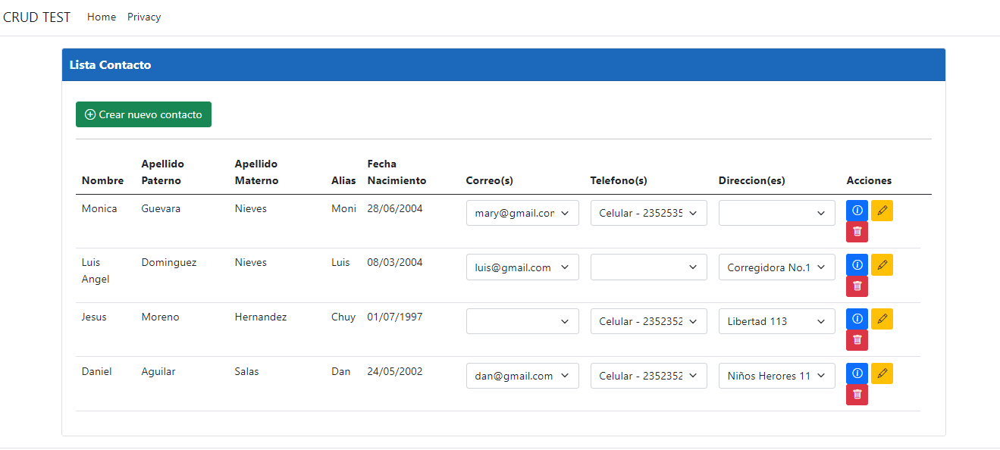
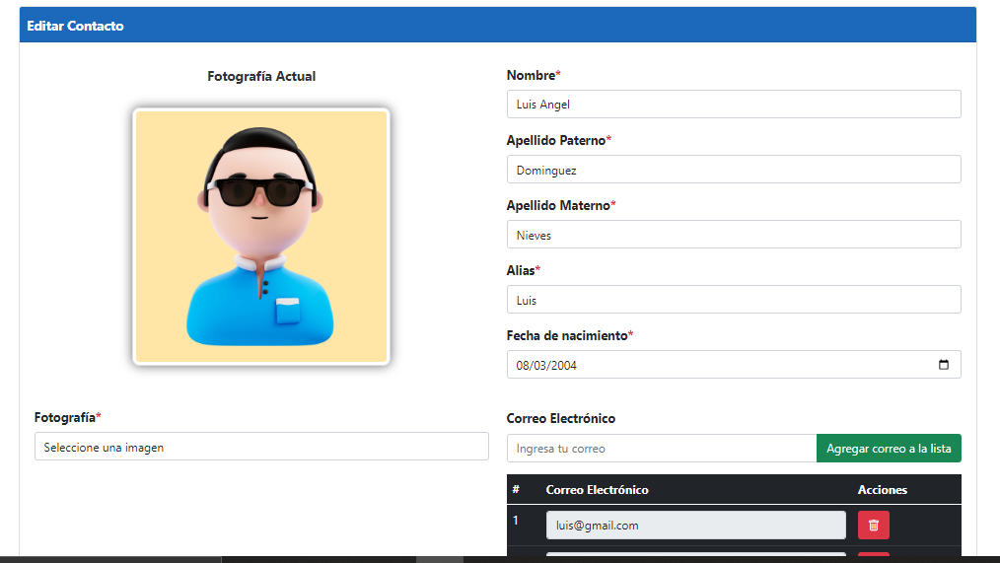

# Agenda (CRUD)

El objetivo principal al crear esta agenda fue poder administrar los registros de los usuarios, crear, editar, eliminar y visualizar la informacion, asi como poner aprueba mis conocimientos en el desarrollo y diseño web, usando tecnologias distintas, en este caso fue ASP.NET, para el **FrontEnd** se usaron tecnologias como HTML5, CSS, JavaScript, Blazor y Boostrap, mientras que para el **BackEnd** se usó SQL Server y Dapper como ORM.

## Screenshots

## Tech Stack

**Client:** HTML5, CSS, JavaScript, Boostrap, Blazor

**Server:** SqlServer, Dapper

